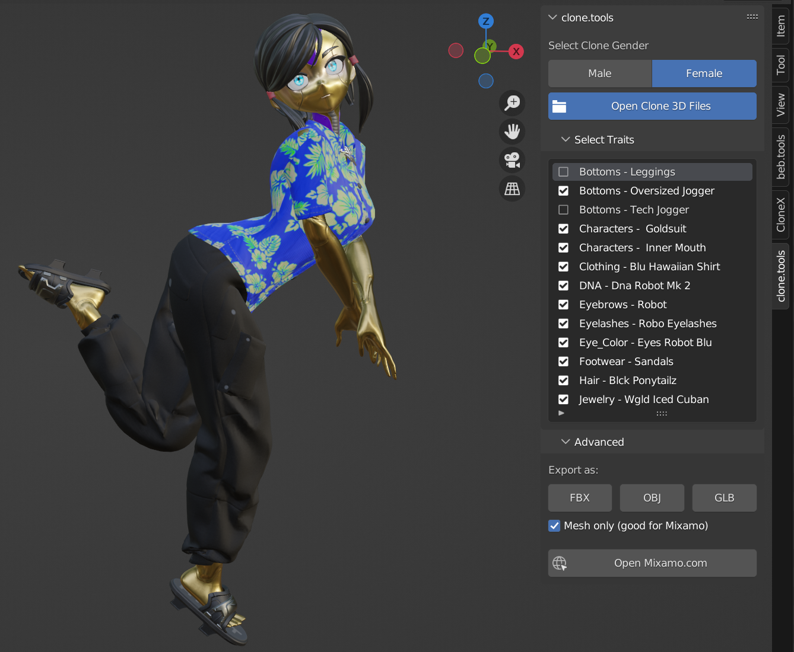

# :dna:Clonex.WTFork

**Clonex.WTFork** is a community-enhanced Blender add-on that provides a comprehensive suite of tools for creating amazing content with CloneX 3D avatars

## 🚀 Community Fork v2.5.0 - Enhanced CloneX Workflow!
**Version 2.5.0** brings **community-driven enhancements** with full **Blender 5.0.0+** compatibility and expanded features.

## Attribution
- This project is a community fork of the original **Clone Tools** addon.
- Original Clone Tools attribution is retained for **RTFKT** in project metadata/docs.
- Fork-specific changes, fixes, and maintenance are by the **WTFork Community**.
- See [CREDITS.md](./CREDITS.md) for attribution details.

[](https://www.blender.org/)
[](./CHANGELOG.md)
[](https://www.python.org/)
[](https://github.com/clonexcreators/Clone_Tools_WTFork)

## Features
The community-enhanced add-on provides users with the ability to:
* **Assemble your clone** from the provided 3D files with intelligent asset management
* **Pose your clone** by selecting from the included Pose Library with hundreds of poses
* **Leverage lighting and camera presets** to achieve beautiful renders with professional quality
* **Export your clone** in multiple formats (FBX, OBJ, GLB) for sharing or use with other platforms like [Mixamo](https://www.mixamo.com/)
* **Manage style libraries** with asset catalogs and collections for easy organization
* **Apply DNA textures and materials** with automatic material node setup
* **Use content packs** for additional poses, animations, and assets
* **Professional rendering tools** with environment controls and staging options
* **Community enhancements** with regular updates and improvements



## 📋 System Requirements

### Minimum Requirements
- **Blender**: 5.0.0 or higher
- **Operating System**: Windows 10+, macOS 10.15+, or Linux (Ubuntu 18.04+)
- **Architecture**: 64-bit systems only
- **Memory**: 8GB RAM minimum
- **Storage**: 500MB free space

### Recommended Requirements
- **Memory**: 16GB RAM (for large CloneX files)
- **Storage**: SSD for better performance
- **GPU**: Dedicated graphics card for faster viewport rendering

## 🔧 Download and Installation

### Prerequisites Check ✅

Before installing, ensure your system meets the requirements:

1. **Verify Blender Version**
   ```
   Help > About Blender
   ```
   - **Required**: Blender 5.0.0 or higher
   - **Recommended**: Latest stable Blender release

2. **System Compatibility**
   - **Windows**: Windows 10 (1903) or newer
   - **macOS**: macOS 10.15 (Catalina) or newer  
   - **Linux**: Ubuntu 18.04+ or equivalent
   - **Architecture**: 64-bit only

3. **Available Space**
   - **Addon**: ~50MB for core addon
   - **Content Packs**: Additional 200-500MB depending on packs
   - **Working Space**: 1GB+ free space recommended

### Installation Methods

#### Method 1: GitHub Release (Free Community Version)

**Step 1: Download**
1. Visit the [Releases](https://github.com/clonexcreators/Clone_Tools_WTFork/releases) page
2. Download the latest addon zip asset (for example `Clone_Tools_WTFork-v2.5.0.zip`)
3. **Do NOT extract** the zip file - Blender needs the intact .zip
4. Note: this source repository does not keep the built addon zip in the repo root; zip files are release artifacts.

**Step 2: Install in Blender**
1. Open **Blender 5.0+**
2. Go to `Edit > Preferences` (Windows/Linux) or `Blender > Preferences` (macOS)
3. Select **Add-ons** tab on the left sidebar
4. Click **Install...** button at the top
5. Navigate to your downloaded addon zip file
6. Select the zip file and click **Install Add-on**
7. Find **"Clonex.WTFork"** in the addon list (use search if needed)
8. **Check the checkbox** to enable the addon
9. Click **Save Preferences** to make the setting permanent

**Step 3: Verify Installation**
1. In the 3D Viewport, press `N` to open the sidebar
2. Look for the **"Clonex.WTFork"** tab
3. You should see the main Clonex.WTFork panel with community branding

#### Method 2: Premium Version (Recommended)

**Enhanced version with additional content packs:**

1. **Purchase** at [Gumroad Store](https://rtfktbeb.gumroad.com/l/clonetools)
2. **Download** the premium zip file from your Gumroad library
3. **Follow the same installation steps** as Method 1 above
4. **Additional content packs** will be automatically available

#### Method 3: Manual Installation (Advanced Users)

**For development or custom installations:**

1. **Clone Repository**
   ```bash
   git clone https://github.com/clonexcreators/Clone_Tools_WTFork.git
   ```

2. **Locate Blender Addons Folder**
   - **Windows**: `%APPDATA%\Blender Foundation\Blender\5.0\scripts\addons\`
   - **macOS**: `~/Library/Application Support/Blender/5.0/scripts/addons/`
   - **Linux**: `~/.config/blender/5.0/scripts/addons/`

3. **Copy Addon Folder**
   ```bash
   cp -r clonex-wtfork /path/to/blender/addons/clonex-wtfork
   ```

4. **Enable in Blender**
   - Follow Step 2 from Method 1, but addon will already appear in list
   - No need to install via zip file

### Post-Installation Setup

#### Initial Configuration

1. **Open Clonex.WTFork Panel**
   - 3D Viewport > Sidebar (N key) > Clonex.WTFork tab

2. **First Time Setup**
   - The addon will automatically initialize required directories
   - No additional configuration needed for basic usage

3. **Content Packs Setup** (Premium Version)
   ```
   Clonex.WTFork Panel > Content Packs > Load Content Pack
   ```

#### Verify All Features Work

**Test Basic Functionality:**
1. Click **"Open Clone 3D Files"** button
2. Navigate to a CloneX folder (even empty folder works for testing)
3. Select **Male** or **Female** gender
4. Panel should expand with additional options

**Test Advanced Features:**
1. **Style Panel**: Should appear after loading files
2. **Pose & Animate**: Should show "Load Pose Library" button
3. **Environment**: Should show "Load Environment Controls" button

### Troubleshooting Installation Issues

#### Common Installation Problems

**❌ Problem: "Add-on not found in list"**
- **Solution**: Clear Blender preferences cache
  ```
  File > Defaults > Load Factory Settings
  ```
  Then reinstall the addon

**❌ Problem: "Blender version too old" error**
- **Solution**: Update to Blender 5.0.0+
- **Check version**: `Help > About Blender`
- **Download latest**: [blender.org](https://www.blender.org/download/)

**❌ Problem: "Import error" or "Module not found"**
- **Solution**: Ensure you installed the complete zip file
- **Check**: The zip should contain `__init__.py` and other Python files
- **Fix**: Redownload and reinstall using intact zip file

**❌ Problem: Addon enables but panel doesn't appear**
- **Solution 1**: Press `N` to toggle 3D Viewport sidebar
- **Solution 2**: Check if panel is collapsed or in different tab
- **Solution 3**: Restart Blender after enabling addon

**❌ Problem: "Permission denied" during installation**
- **Windows**: Run Blender as Administrator
- **macOS**: Check Security & Privacy settings
- **Linux**: Ensure write permissions to Blender config directory

#### Advanced Troubleshooting

**Check Console for Errors:**
1. Open Blender
2. Go to `Window > Toggle System Console` (Windows) or check Terminal (macOS/Linux)
3. Enable addon and look for error messages
4. Report errors with full error text when seeking help

**Clean Installation:**
1. **Disable** clone.tools addon in preferences
2. **Remove** addon files from addons directory
3. **Restart** Blender
4. **Reinstall** using fresh download

**Compatibility Check:**
```python
# Paste in Blender's Python Console (Scripting workspace)
import bpy
print(f"Blender: {bpy.app.version}")
print(f"Python: {bpy.app.version_string}")
```

### Installation Verification Checklist

✅ **Basic Installation**
- [ ] Blender 5.0.0+ installed and running
- [ ] Clonex.WTFork addon appears in Add-ons list  
- [ ] Addon enabled with checkbox checked
- [ ] Clonex.WTFork panel visible in 3D Viewport sidebar

✅ **Core Functionality**
- [ ] "Open Clone 3D Files" button works
- [ ] Gender selection (Male/Female) available
- [ ] Style panel appears after file loading
- [ ] No error messages in console

✅ **Advanced Features** (if applicable)
- [ ] Content packs load correctly
- [ ] Pose library accessible
- [ ] Environment controls working
- [ ] Export functions available

### Getting Additional Help

If you encounter issues not covered here:

1. **Check Documentation**
   - [Version Compatibility](./VERSION_INFO.md)
   - [Changelog](./CHANGELOG.md) for known issues

2. **Community Support**
   - [GitHub Issues](https://github.com/clonexcreators/Clone_Tools_WTFork/issues)
   - WTFork Discord community
   - Blender Artists forum

3. **When Reporting Issues**
   Include this information:
   - Blender version (`Help > About`)
   - Operating system and version
   - Clonex.WTFork version (check addon preferences)
   - Error messages from console
   - Steps to reproduce the problem

### Next Steps After Installation

Once successfully installed, check out:
- **[Quick Start Guide](#-quick-start-guide)** below
- **[Features Showcase](#-features-showcase)** for detailed capabilities
- **Content packs** for additional poses and animations

## 🎯 Quick Start Guide

1. **Load CloneX Files**: Click "Open Clone 3D Files" and select your CloneX folder
2. **Select Gender**: Choose male or female avatar base
3. **Style Your Clone**: Use the Style panel to equip wearables and accessories
4. **Pose Your Clone**: Switch to Pose mode and select from the pose library
5. **Set Up Scene**: Use Environment controls for lighting and staging
6. **Render**: Use the Camera and Render panels for high-quality output

## 📚 Documentation

- **[Changelog](./CHANGELOG.md)**: Detailed version history and updates
- **[Version Info](./VERSION_INFO.md)**: Compatibility matrix and technical details
- **[Issues](https://github.com/rtfkt-inc/CloneTools/issues)**: Report bugs or request features

## 🔄 Migrating from Previous Versions

### From Blender 3.2/4.x to 5.0
- ✅ **All CloneX files remain compatible**
- ✅ **No workflow changes required**
- ✅ **Style libraries and content packs work as before**
- ✅ **Export settings and preferences preserved**

Simply install the new version and continue working with your existing files!

## 🆘 Support

### Getting Help
- **GitHub Issues**: [Report bugs or request features](https://github.com/clonexcreators/Clone_Tools_WTFork/issues)
- **Community**: Join the WTFork Discord for community support
- **Documentation**: Check the linked documentation files above

### Reporting Issues
When reporting issues, please include:
- Clonex.WTFork version (check in Add-ons preferences)
- Blender version and build info
- Operating system and version
- Steps to reproduce the issue
- Error messages from Blender console (Window > Toggle System Console)

## 🎨 Features Showcase

### Style Management
- Asset catalogs for organized wearable collections
- Automatic material node setup for DNA textures
- Real-time preview system for styles and accessories
- Smart collection management with automatic unpacking

### Pose & Animation System  
- Extensive pose library with male and female variants
- Animation blending and NLA track management
- Content pack support for additional poses
- Easy pose mode switching and bone selection

### Professional Rendering
- Multiple lighting presets (studio, outdoor, dramatic)
- Environment staging options (skybox, light catcher)
- Camera controls with professional settings
- Export tools for multiple formats (FBX, OBJ, GLB)

## 🏆 Contributors

<table>
    <td align="center">
        
        <br />
        <a href="https://twitter.com/beb_eth"></a>
    </td>
    <td align="center">
        
        <br />
        <a href="https://twitter.com/0xBGoat"></a>
    </td>
    <td align="center">
        
        <br />
        <a href="https://twitter.com/blenderdac"></a>
    </td>
    <td align="center">
        
        <br />
        <a href="https://twitter.com/rtsnRegis"></a>
    </td>
    <td align="center">
        
        <br />
        <a href="https://twitter.com/VegaGenesisTM"></a>
    </td>
</table>

## 📄 License

This project is licensed under the terms specified in the [LICENSE](./LICENSE) file.

## 🚀 Future Roadmap

- Enhanced content pack management
- Additional export formats and options  
- Performance optimizations for large scenes
- Integration with more external platforms
- Advanced material and shader options

---

**Made with ❤️ by the WTFork Community for the CloneX ecosystem**

*Clonex.WTFork v2.5.0 - Compatible with Blender 5.0.0+*

> Community fork of the original Clone Tools by RTFKT - Enhanced and maintained by the community
